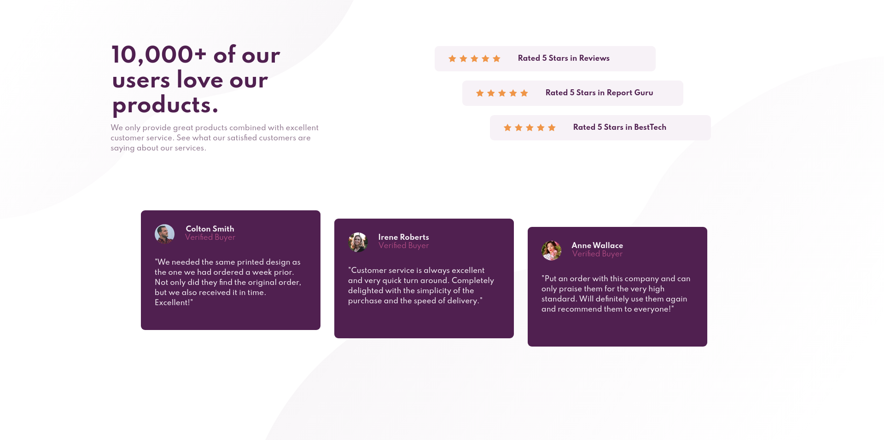

# Frontend Mentor - Social proof section solution

This is a solution to the [Social proof section challenge on Frontend Mentor](https://www.frontendmentor.io/challenges/social-proof-section-6e0qTv_bA). 

## Table of contents

- [Overview](#overview)
  - [The challenge](#the-challenge)
  - [Screenshot](#screenshot)
  - [Links](#links)
- [My process](#my-process)
  - [Built with](#built-with)
  - [What I learned](#what-i-learned)
  - [Continued development](#continued-development)
  - [Useful resources](#useful-resources)
- [Author](#author)


## Overview

### The challenge

Users should be able to:

- View the optimal layout for the section depending on their device's screen size

### Screenshot



### Links

- Solution URL: [solution](https://www.frontendmentor.io/solutions/responsivesocialproofsectionwebsite-9aCpImOxX)
- Live Site URL: [live site](https://costivoicu.github.io/Responsive-social-proof-section-website/)

## My process

### Built with

- Semantic HTML5 markup
- Sass variables
- Flexbox
- Mobile-first workflow
- Background images

**Note: These are just examples. Delete this note and replace the list above with your own choices**

### What I learned

- Sass mixin

```scss
@mixin center_flex ($direction){
    display: flex;
    justify-content: center;
    align-items: center;
    flex-direction: $direction;
}

@mixin dim ($width){
    width: $width;
    height: auto;
}

@mixin text_center{
    text-align: center;
}
```
- How to create variabels in sass

```scss
$desktop-size: 1440px;
$very-dark-magenta: hsl(300, 43%, 22%);
$soft-pink: hsl(333, 80%, 67%);
$dark-grayish-magenta: hsl(303, 10%, 53%);
$light-grayish-magenta: hsl(300, 24%, 96%);
$white: hsl(0, 0%, 100%);
$font-size: 15px;
$font-family: 'Spartan';
$small-weight: 400;
$medium-weight: 500;
$big-weight: 700;
```

- How to import files in sass

```scss
@import './variabels';
@import './style';
```

- How to include mixins

```scss
@include center_flex(column);
```

### Continued development

- Centering the whole content
- Alining the article and the title to the big cards

### Useful resources

- [@mixin and @include](https://sass-lang.com/documentation/at-rules/mixin) - This helped me to understand  mixin and include in sass. I'd recommend it to anyone still learning sass.

## Author

- My GitHub profile - [Costi Voicu](https://github.com/CostiVoicu)
- Frontend Mentor - [@JustAFatRaccoon](https://www.frontendmentor.io/profile/JustAFatRaccoon)
- Twitter - [@VoicuCosti2](https://twitter.com/VoicuCosti2)
- Instagram - [@c0stiv0icu](https://www.instagram.com/c0stiv0icu/)
